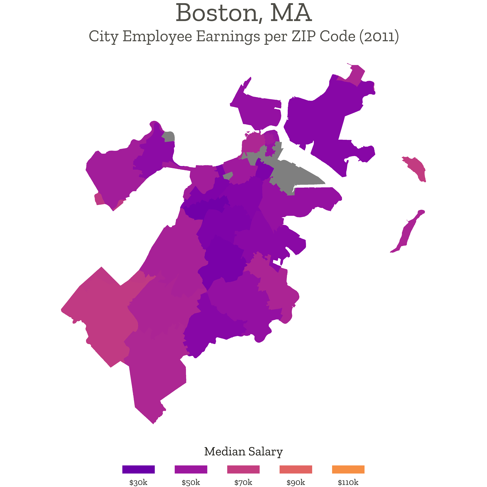
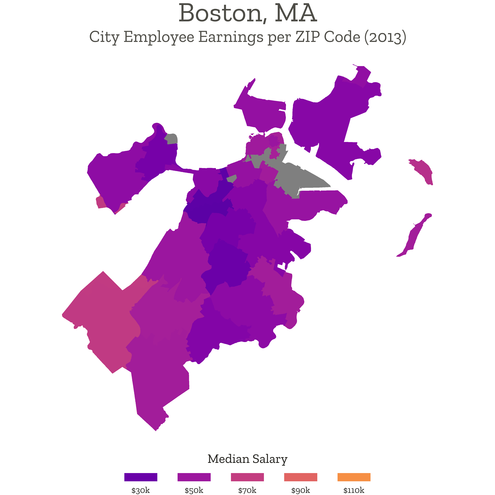
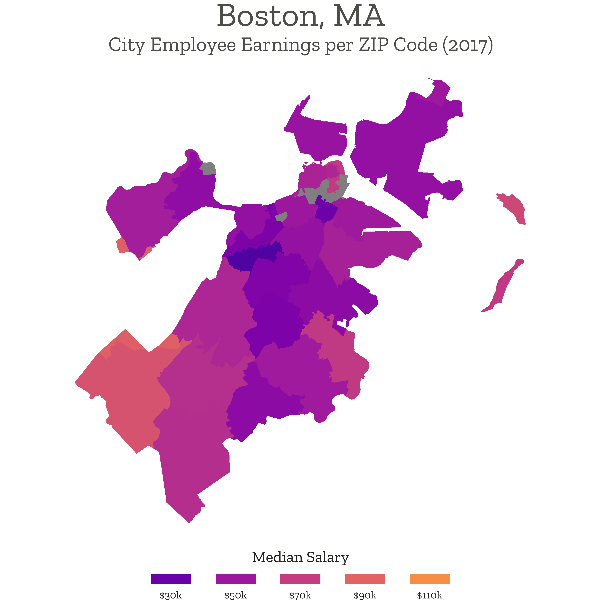
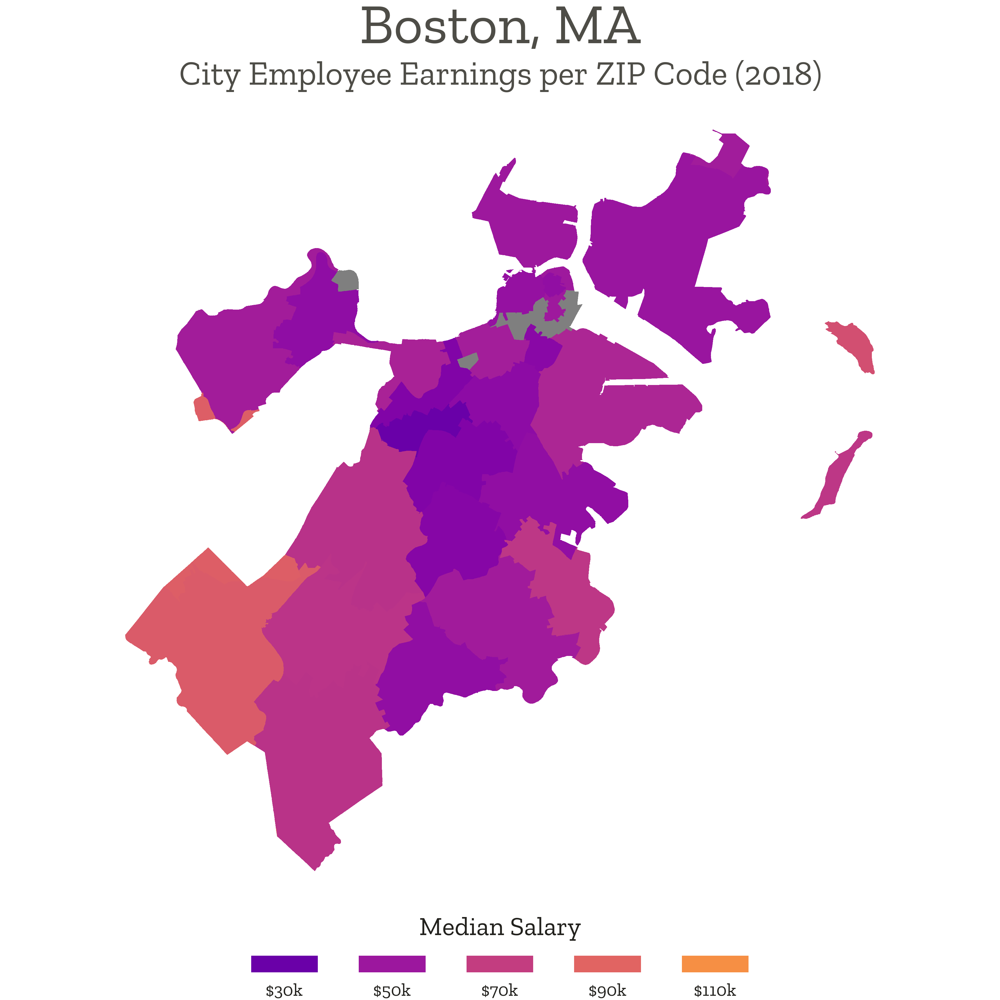
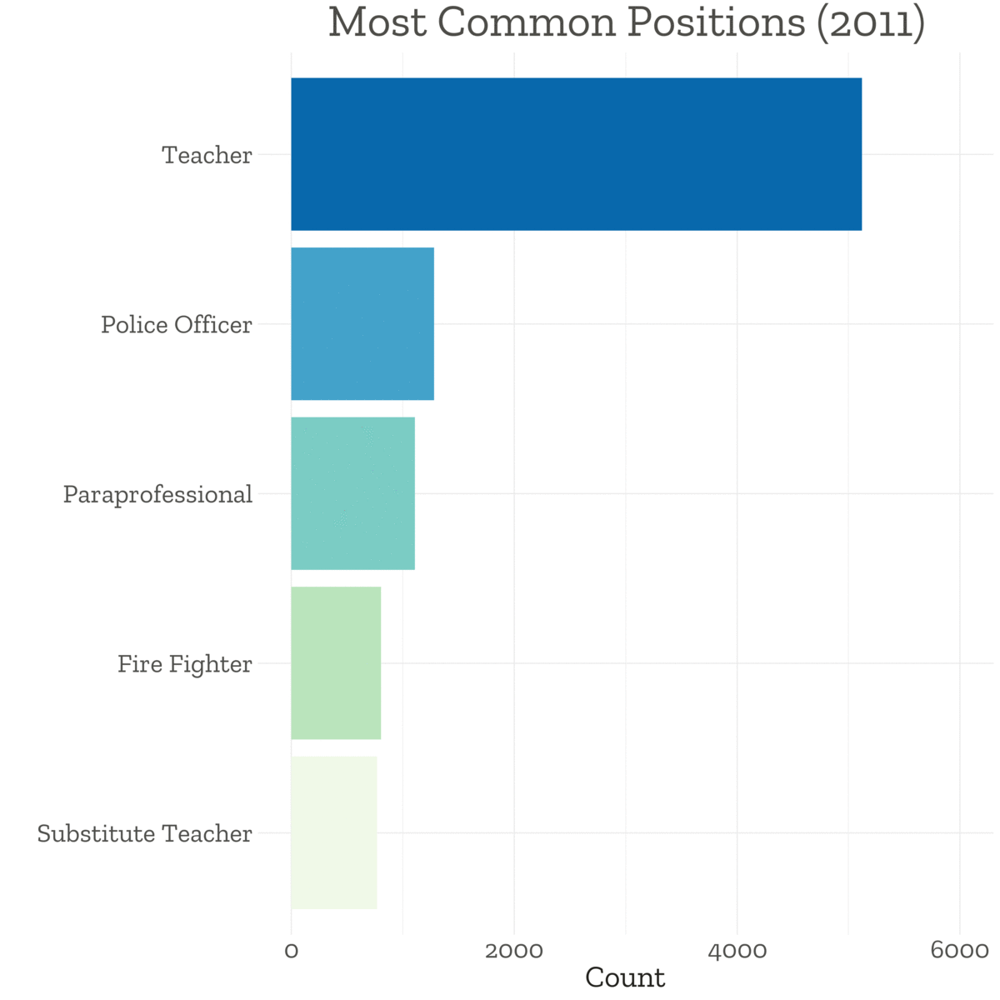
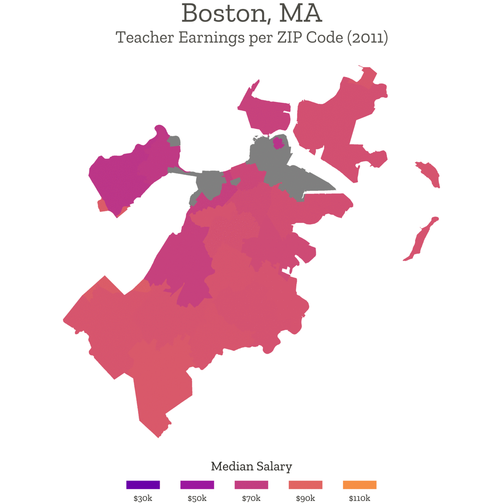

# Boston ZIP Earnings Project

## Update
This project is currently undergoing review to be hosted on the City of Boston's [Analyze Boston Showcase](https://data.boston.gov/showcase).

## Table of Contents
 * [Description](#description)
 * [Background](#background)
 * [Findings](#findings)
 * [Methods](#methods)
 * [Link](#link)

## Description
This is a personal project to show how median city employee earnings have evolved over the past decade in the neighborhoods of Boston. I was originally interested in looking at this data because my mother is a teacher in the Boston Public Schools, but what started out as peripheral interest eventually blossomed into its own larger project. [Earnings data](https://data.boston.gov/dataset/employee-earnings-report) and [geographical data](https://data.boston.gov/dataset/boston-neighborhoods) were taken from [Analyze Boston](https://data.boston.gov/), a recent effort by the city of Boston to encourage analysis of open data. This README is mostly a recapitulation of the information at the [project website](https://ggrajeda.github.io/boston-zip-earnings/).

## Background
Boston is often argued to be a [racially segregated city](https://www.wbur.org/cognoscenti/2020/01/16/racial-segregation-boston-housing-ivan-espinoza-madrigal-oren-sellstrom-janelle-dempsey). This issue of racial segregation is highly important, as segregation can lead to disparate levels of access to health care, public education, and other forms of capital between racial and ethnic groups. My work focuses on a different, but related, subject: the issue of economic segregation. The infographics below show significant disparities between the median city employee salaries of Boston neighborhoods, even among adjacent neighborhoods. And these disparities appear to be getting slightly <i>worse</i> over time&mdash;not better. Whether due to lower levels of city investment or lower quality of public education in these neighborhoods, the economic disparities between Boston neighborhoods must be addressed.

## Findings
Below are a few choropleth maps to help visualize the income disparities between neighborhoods. For those unfamiliar with Boston's geography, concentrate on the middle of the city. Some of the darker neighborhoods in the chart are Fenway, Roxbury, Mission Hill, Dorchester, and Mattapan. These five neighborhoods have relatively low median household incomes. Indeed, to some extent, city employee salaries can serve as a proxy for broader household income. See <b>Methods</b> for more details.

The chart below shows how median city employee salaries have changed from 2011 (top left) to 2019 (bottom right). Darker purple neighborhoods have lower salaries than orange neighborhoods. ZIP codes with fewer than twenty workers have been removed from the data set.

 

	

		
		
		
	

	 
	

		
		
		
	

	 
	

		
		
		
	

 

Notice how the center of the city remains dark while western Boston becomes lighter over time. Put simply, this chart shows that city employee salaries have risen substantially in West Roxbury, Hyde Park, and Roslindale, but not as much in Fenway, Roxbury, Mission Hill, Dorchester, or Mattapan. This will be discussed in more detail later. For the sake of visualization, here is a time-lapse gif of the chart above.

We might also want to visualize the breakdown of the most common city employee positions. Since we are studying a very specific subset of Boston workers, it is possible that a few positions have a disproportionate influence on our data. Below is a time-lapse gif showing the five most common city employee positions over the last decade. (Positions after the top five are not shown.)  

Indeed, a plurality of city employees are teachers. From 2011 to 2019, teachers outnumbered cops&mdash;or any other single position&mdash;by more than 3:1. To put this fact into perspective, there are 1,474 distinct Boston city employee positions, but the title "teacher" accounts for a fourth of city employees. The next four most common positions after teachers were police officers, paraprofessionals, fire fighters, and substitute teachers. All four of these positions experienced some fluctuation in their rankings as teachers easily maintained a number one spot throughout the decade.

The over-representation of teachers may pose an issue in our analysis, since teachers tend to be higher-paid employees. For reference, the median Boston Public School teacher salary has ranged between $80,000 and $96,500 from 2011 to 2019. The median salary of non-teacher employees, on the other hand, has ranged between $43,000 and $54,000. So we will subset into two groups: teachers and non-teachers.

Here is a time-lapse gif of median teacher salaries by neighborhood with the same color scale as before.

And a time-lapse gif of median non-teacher salaries by neighborhood.

At a glance, the results are unsurprising. On average, teachers make more money than non-teacher city employees, and so the first map is lighter than the second. However, upon closer inspection, we find that both maps exhibit three common trends. These are the central findings of this project: 

First, the salaries of the northeastern neighborhoods&mdash;excluding the islands&mdash;are relatively constant. These neighborhoods (Charlestown, East Boston, and South Boston) have seen very gradual increases in their salaries, if any at all. Second, the salaries of the southwestern neighborhoods&mdash;mainly West Roxbury and Hyde Park&mdash;appear to be rising consistently. These neighborhoods started well off in 2011 and were even better off by 2019. Third, the center of the city is noticeably darker than other areas, especially in comparison to southwestern Boston. City employees here&mdash;in Fenway, Roxbury, Mission Hill, Dorchester, and Mattapan&mdash;are invariably earning less than their counterparts in other neighborhoods. It is important to note that these trends hold among teachers and non-teachers. Thus, disparities between neighborhoods appear even when partitioning the data into blocks of comparable education and profession.

## Methods
Source code for the project can be found in this repo.

One common question might be whether it is appropriate to use city employee salaries as a proxy for household income. The answer is somewhere between yes and no. While it seems that city employee salaries correlate strongly with household income reported by the census, the former data set excludes some obvious outliers on both sides of the spectrum. The homeless and unemployed are not included in city employee salary data. Neither are wealthy financiers in downtown Boston. Yet while city employee earnings may not reflect the full range of incomes in Boston, the data set does a reasonable job of depicting general trends. And city data has one important advantage over census data: it is reported yearly. While census data gives us insight into trends at the macroscopic level, city data sets allow us to follow micro-trends.

Another common question might be whether any controls were used. This project is admittedly exploratory, so apart from the blocking, I did not control for many relevant variables, and regrettably, there were not enough city employees in non-teaching jobs to subset by profession further than "teacher" and "non-teacher." But it is important to note that the point of the project is not to make the claim that city employers are consciously discriminating against residents of a certain neighborhood. The goal of this project is instead to show that there are substantial disparities in city employee earnings between the neighborhoods of Boston, disparities that may point to a deeper structural issue like inequality of opportunity.

## Link
[https://ggrajeda.github.io/boston-zip-earnings/](https://ggrajeda.github.io/boston-zip-earnings/)
